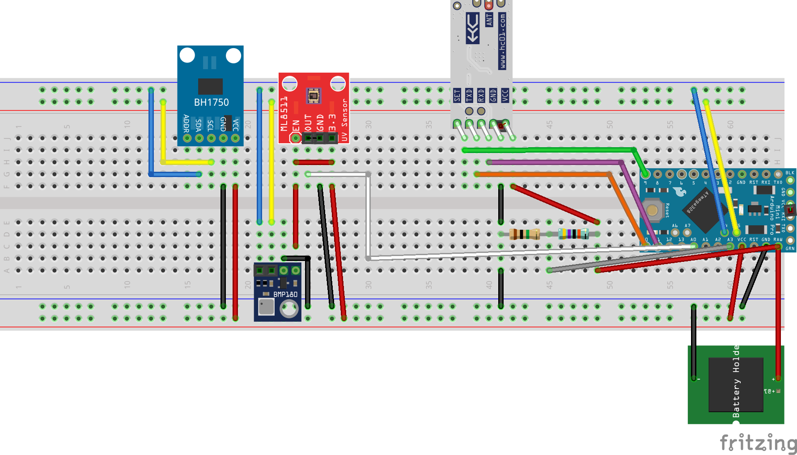
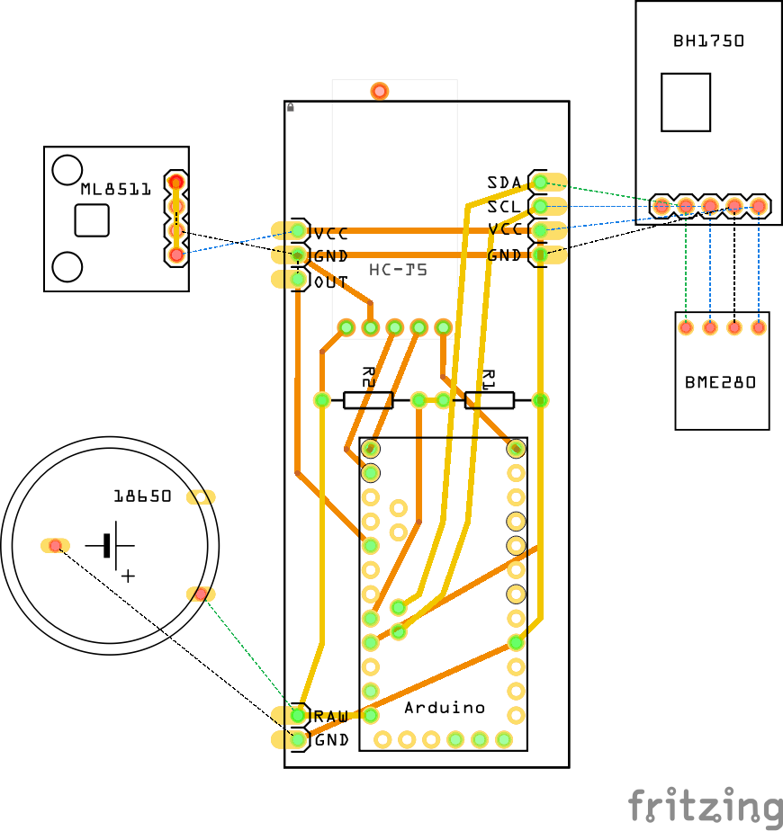

# Weather-Station
Arduino based weather station

## Components

| Component | Description | Datasheet | Purchase |
|---|---|---|---|
| Arduino Pro Mini | 3V3 8Mhz | [Web](https://store.arduino.cc/arduino-pro-mini) | [eBay](https://www.ebay.es/itm/2PCS-Pro-Mini-atmega328-3-3V-8M-board-Replace-ATmega128-Arduino-Compatible-Nano/201079705361)|
| BME280 | Barometric pressure, humidity and temperature | [PDF](https://cdn-shop.adafruit.com/datasheets/BST-BME280_DS001-10.pdf)| [eBay](https://www.ebay.es/itm/Breakout-Temperature-Humidity-Barometric-Pressure-BME280-Digital-Sensor-Modul-I2/392645861291)|
| BH1750 | Ambient light | [PDF](https://www.mouser.com/datasheet/2/348/bh1750fvi-e-186247.pdf) | [eBay](https://www.ebay.es/itm/GY30-BH1750FVI-Digital-Light-intensity-Sensor-Module-For-Arduino-3V-5V-Power/201993327268) |
| ML8511 | UV intensity|  [PDF](https://cdn.sparkfun.com/datasheets/Sensors/LightImaging/ML8511_3-8-13.pdf) | [eBay](https://www.ebay.es/itm/ML8511-UVB-UV-Rays-Sensor-Breakout-UV-Light-Sensor-Analog-Output-for-Arduino/400936528899)
| HC-12 | Wireless communication | [PDF](https://www.elecrow.com/download/HC-12.pdf) | [eBay](https://www.ebay.es/itm/433Mhz-HC-12-SI4463-Wireless-Serial-Port-Module-1000m-Replace-Bluetooth-TOP/401051275954) |

## Wiring design

## PCB design

